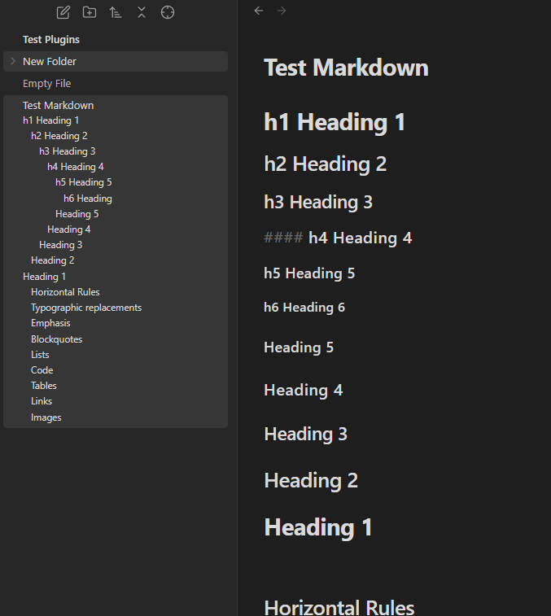
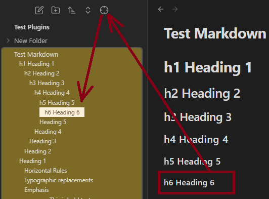
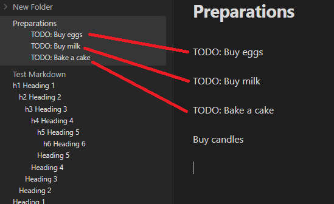

# Obsidian Headings in Explorer

This Obsidian plugin makes headings first class concepts in the file explorer and consolidates navigation to a single panel. 

It displays headings under documents in the file explorer for easier access. This is intended to combine the view-only features of the core outline plugin directly into the file explorer. 

Since it relies on some existing core plugins, it will only work on desktop versions of Obsidian.

## Usage

### Headings

All headings are automatically put into a clickable hierarchy in the file explorer.



You can configure which levels of headings to include/omit in the settings.

### Highlight Location

Highlight Location is a convenience button in the file explorer navbar that mimicks the reveal file location functionality. It will reveal and highlight the heading your cursor is under in the file explorer. 



If you have multiple tabs open at the same time, it will take you to the location of the last one you clicked your cursor on.

## Installing

Headings in Explorer is in the Community Plugins section of Obsidian’s settings. That is the preferred way of getting this plugin.

You can also install it manually by copying over `main.js`, `styles.css`, `manifest.json` to your vault `VaultFolder/.obsidian/plugins/obsidian-headings-in-explorer`.

## Troubleshooting

If the headings aren't updating, the metadata cache might be outdated. Reloading/restarting the editor can fix it.

If there are problems with the settings or if you've accidentally changed the defaults, resetting to default might fix it.

## Advanced Usage

Additional non-heading text can be matched and put into the explorer as well. This is configurable in the settings. By default, entirely bolded lines are considered h7's.

For example, using this regex:

```
^(TODO:.*)$
```

You can now match lines that start with TODO: in the files to show up as if they are headings:



## Development

- Clone this repo.
- Make sure your NodeJS is at least v16 (`node --version`).
- `npm i` or `yarn` to install dependencies.
- `npm run dev` to start compilation in watch mode.
- Feel free to file a pull request with any improvements.